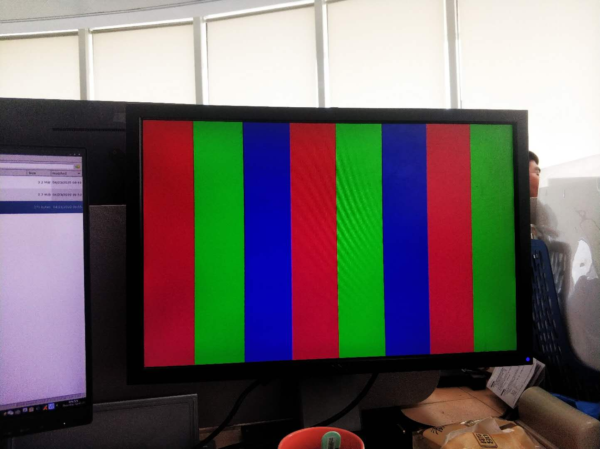

用于模仿 dvp raw 摄像头的视频源模块，运行于XO3, 接入hi3559av100验证

ifconfig eth0 192.168.1.47

mount -t nfs -o nolock -o tcp -o rsize=32768,wsize=32768 192.168.1.32:/home/andy/targetfs/ /mnt

cd /mnt/ko

./load3559av100_multicore -i -sensor0 ov9712

cd ../vio

./sample_vio_ov9712_dvp_8_0 8 0

